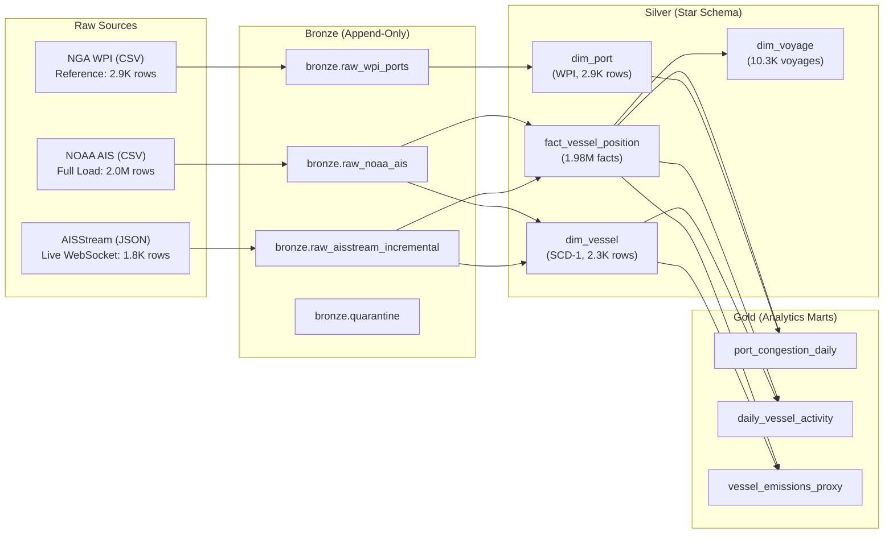

# Maritime Shipment & Cargo Tracking Lakehouse

[](https://databricks.com)
[](https://spark.apache.org)
[](https://delta.io)
[](https://docs.databricks.com/data-governance/unity-catalog/index.html)

An end-to-end Medallion Lakehouse pipeline on Databricks ingesting, modeling, and analyzing high-frequency Automatic Identification System (AIS) vessel telemetry and global port infrastructure data.

---

## 1. Architecture Overview



---

## 2. Lakehouse Data Model

### Silver Star Schema

| Table | Type | Primary Key | Key Attributes | Rows |
| :--- | :--- | :--- | :--- | :--- |
| `silver.dim_vessel` | Dimension | `mmsi` | `vessel_name`, `imo`, `call_sign`, `vessel_type`, `length`, `width`, `draft` | 2,320 |
| `silver.dim_port` | Dimension | `port_code` | `port_number`, `port_name`, `country`, `latitude`, `longitude`, `harbor_size` | 2,938 |
| `silver.fact_vessel_position` | Fact | `(mmsi, timestamp)` | `latitude`, `longitude`, `sog`, `cog`, `heading`, `status`, `source` | 1,979,953 |
| `silver.dim_voyage` | Dimension | `voyage_id` | `mmsi`, `departure_time`, `arrival_time`, `arrival_port_code`, `position_count` | 10,305 |

*All Silver writes use idempotent `MERGE INTO` (zero duplication on re-execution).*

### Gold Business Marts

| Table | Grain | Key Metrics |
| :--- | :--- | :--- |
| `gold.port_congestion_daily` | Port × Date | Vessels in port, dwell time proxy |
| `gold.daily_vessel_activity` | MMSI × Date | `total_distance_km`, `avg_speed_knots`, `operating_hours` |
| `gold.vessel_emissions_proxy` | MMSI × Date | Fuel burn proxy (tonnes, Admiralty cube law), `co2_proxy_tonnes` |

---

## 3. Pipeline Execution Guide

Run the notebooks sequentially in Databricks:

```
notebooks/
├── 00_setup_schemas.py              # Creates bronze, silver, gold, maritime_ops & quarantine
├── 03_bronze_wpi_reference.py       # Ingests WPI port reference data into bronze
├── 05_silver_dim_port.py            # Converts DMS coords, parses port codes, merges dim_port
├── 01_bronze_noaa_full_load.py      # Ingests NOAA AIS CSV baseline (2.0M records)
├── 02_bronze_aisstream_incremental.py  # Ingests daily live AIS WebSocket JSON feed
├── 04_silver_dim_vessel.py          # Windowed deduplication & merge into dim_vessel
├── 06_silver_fact_position.py       # Validates coordinates & merges into fact_vessel_position
├── 07_silver_dim_voyage.py          # Haversine distance & windowed voyage segmentation
└── 08_gold_aggregations.py          # Refreshes all 3 Gold summary aggregation tables
```

### Raw Data Volumes
Place input files in `/Volumes/workspace/bronze/raw_data/`:
- `WPI.csv` — Global port directory
- `AIS_Full_Load.csv` — NOAA MarineCadastre baseline (Gulf of Mexico)
- `ais_daily_YYYYMMDD.json` — Generated by local collector (`src/collector/aisstream_collector.py`)

---

## 4. Engineering Standards & Observability

- **Zero Schema Inference**: All ingestion enforces explicit Spark typing; corrupt lines route to `bronze.quarantine`.
- **Audit Logging**: Every stage records metrics via `PipelineLogger` to `workspace.maritime_ops.pipeline_execution_logs`:
  ```sql
  SELECT layer, parameter, status, rows_inserted, rows_updated,
         ROUND(UNIX_TIMESTAMP(end_time) - UNIX_TIMESTAMP(start_time), 2) AS duration_seconds
  FROM workspace.maritime_ops.pipeline_execution_logs
  ORDER BY start_time DESC;
  ```
- **FinOps Optimization**: Bounding-box filtering (`29.20N to 29.35N, -94.70W to -94.54W`) scopes volume to Galveston/Houston transit corridor, ensuring sub-second aggregations on Serverless compute.
