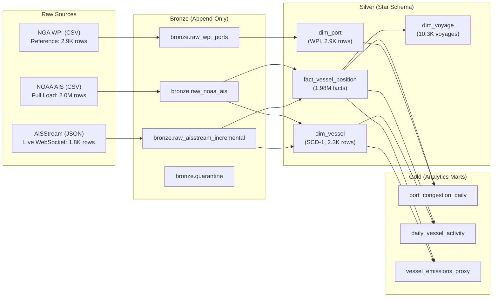

# Maritime Shipment & Cargo Tracking Lakehouse

[](https://databricks.com)
[](https://spark.apache.org)
[](https://delta.io)
[](https://docs.databricks.com/data-governance/unity-catalog/index.html)

An end-to-end Medallion Lakehouse pipeline on Databricks ingesting, modeling, and analyzing high-frequency Automatic Identification System (AIS) vessel telemetry and global port infrastructure data.

---

## 1. Architecture Overview



---

## 2. Lakehouse Data Models

### 2.1 Bronze Raw Tables

All Bronze tables use explicit PySpark `StructType` schema contracts (zero schema inference) and record metadata including `load_timestamp`:

| Table | Source | Primary Key / Grain | Key Columns | Rows |
| :--- | :--- | :--- | :--- | :--- |
| `bronze.raw_noaa_ais` | NOAA Cadastre CSV | `(MMSI, BaseDateTime)` | `MMSI`, `BaseDateTime`, `LAT`, `LON`, `SOG`, `COG`, `Heading`, `VesselName`, `IMO`, `load_timestamp` | 2,003,012 |
| `bronze.raw_aisstream_incremental` | WebSocket JSON | `(mmsi, time_utc)` | `mmsi`, `ship_name`, `latitude`, `longitude`, `sog`, `cog`, `nav_status`, `ship_type`, `load_timestamp` | 1,870 |
| `bronze.raw_wpi_ports` | NGA Pub 150 CSV | `portNumber` | `portNumber`, `portName`, `countryCode`, `latitude`, `longitude`, `harborSize`, `load_timestamp` | 2,951 |
| `bronze.quarantine` | Corrupted Rows | `quarantine_id` | `quarantine_id`, `source`, `batch_id`, `raw_payload`, `error_reason`, `quarantine_timestamp` | Audit |

### 2.2 Silver Star Schema (Conformed Facts & Dimensions)

All Silver tables are populated via **idempotent `MERGE INTO`** (zero duplicate rows upon repeated executions):

| Table | Type | Primary Key | Key Attributes | Rows |
| :--- | :--- | :--- | :--- | :--- |
| `silver.dim_vessel` | Dimension | `mmsi` (BIGINT) | `vessel_name`, `imo`, `call_sign`, `vessel_type`, `length`, `width`, `draft`, `load_timestamp` | 2,320 |
| `silver.dim_port` | Dimension | `port_code` (STRING) | `port_number`, `port_name`, `country`, `country_code`, `latitude`, `longitude`, `harbor_size`, `load_timestamp` | 2,938 |
| `silver.fact_vessel_position` | Fact | `(mmsi, timestamp)` | `latitude`, `longitude`, `sog`, `cog`, `heading`, `status`, `source`, `load_timestamp` | 1,979,953 |
| `silver.dim_voyage` | Dimension | `voyage_id` (STRING) | `mmsi`, `voyage_seq`, `departure_time`, `arrival_time`, `arrival_port_code`, `position_count`, `load_timestamp` | 10,305 |

### 2.3 Gold Business Marts

| Table | Grain | Key Metrics | Rows |
| :--- | :--- | :--- | :--- |
| `gold.port_congestion_daily` | Port × Date | `vessels_in_port`, port dwell proxy | 124 |
| `gold.daily_vessel_activity` | MMSI × Date | `total_distance_km`, `avg_speed_knots`, `operating_hours` | 13,133 |
| `gold.vessel_emissions_proxy` | MMSI × Date | `fuel_burn_proxy_tonnes` (Admiralty cube law), `co2_proxy_tonnes` | 13,133 |

---

## 3. Pipeline Execution & Backfill Guide

Run the notebooks sequentially in Databricks:

```
notebooks/
├── 00_setup_schemas.py              # Creates bronze, silver, gold, maritime_ops & quarantine
├── 03_bronze_wpi_reference.py       # Ingests WPI port reference data into bronze
├── 05_silver_dim_port.py            # Converts DMS coords, parses port codes, merges dim_port
├── 01_bronze_noaa_full_load.py      # Ingests NOAA AIS CSV baseline (2.0M records)
├── 02_bronze_aisstream_incremental.py  # Ingests daily live AIS WebSocket JSON feed
├── 04_silver_dim_vessel.py          # Windowed deduplication & merge into dim_vessel
├── 06_silver_fact_position.py       # Validates coordinates & merges into fact_vessel_position
├── 07_silver_dim_voyage.py          # Haversine distance & windowed voyage segmentation
└── 08_gold_aggregations.py          # Refreshes all 3 Gold summary aggregation tables
```

### Backfill vs. Incremental Parameter Guide

Each ingestion notebook uses **Databricks Widgets** (`source_path` and `batch_id`) to allow dynamic parameterization from the UI or automated Databricks Workflows without editing code:

- **Standard Incremental Run**: Run `02_bronze_aisstream_incremental` with the latest daily JSON path.
- **Historical Backfill**: Set `source_path` widget to any historical file (e.g. `/Volumes/workspace/bronze/raw_data/historical_batch.csv`) and specify a unique `batch_id`.
- **Idempotency Guarantee**: Because Silver transformations use `MERGE INTO`, re-running any historical date or batch produces zero duplicate rows in the analytical layers.

### Raw Data Volume Storage
Input files are stored in Unity Catalog Volume at `/Volumes/workspace/bronze/raw_data/`:
- `WPI.csv` — Global port directory
- `AIS_Full_Load.csv` — NOAA MarineCadastre baseline (Gulf of Mexico, ~219 MB)
- `ais_daily_YYYYMMDD.json` — Generated by local collector (`src/collector/aisstream_collector.py`)

---

## 4. Engineering Standards & Observability

- **Explicit Schemas & Zero Inference**: Enforced via PySpark `StructType` / `StructField` APIs; non-conforming lines route to `bronze.quarantine`.
- **Audit Logging**: Every stage records metrics via `PipelineLogger` to `workspace.maritime_ops.pipeline_execution_logs`:
  ```sql
  SELECT layer, parameter, status, rows_inserted, rows_updated,
         ROUND(UNIX_TIMESTAMP(end_time) - UNIX_TIMESTAMP(start_time), 2) AS duration_seconds
  FROM workspace.maritime_ops.pipeline_execution_logs
  ORDER BY start_time DESC;
  ```
- **FinOps Optimization**: Bounding-box filtering (`29.20N to 29.35N, -94.70W to -94.54W`) scopes volume to Galveston/Houston transit corridor, ensuring sub-second aggregations on Serverless compute.
