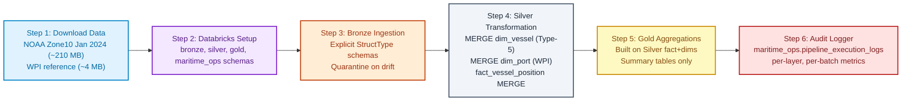
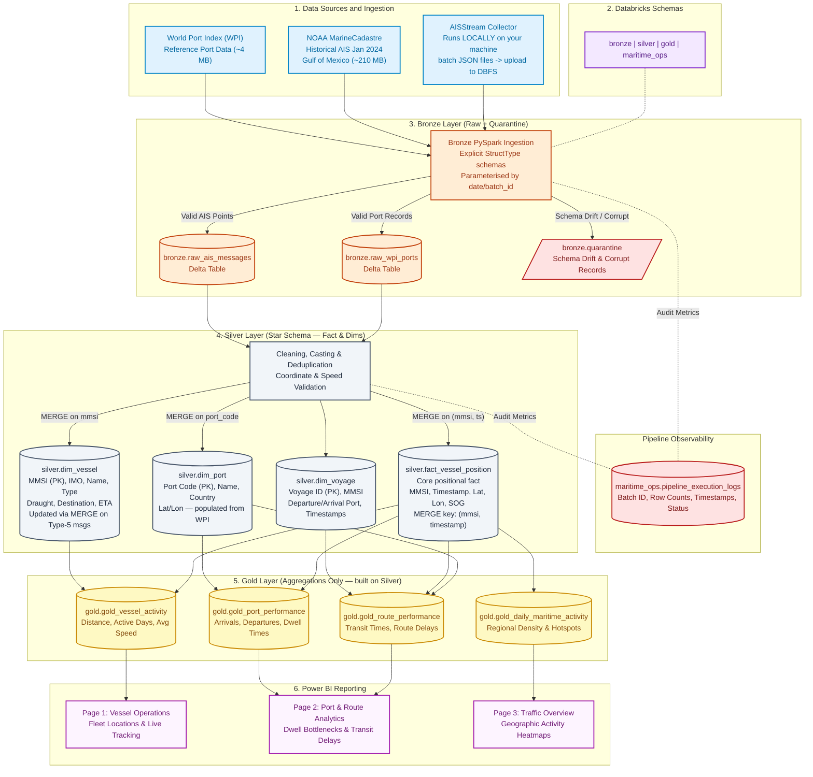

# Maritime Data Pipeline - Roadmap & Architecture

## 1. Phase 1 → Phase 2 Implementation Roadmap



---

## 2. Phase 2 Requirements Summary

Phase 2 transitions the project from a basic script to an enterprise-grade Lakehouse pipeline. The following hard requirements must all be met:

### 2.1 Infrastructure & Environment
- Platform: **Databricks Community Edition** (or Azure with student credits)
- All notebooks/scripts committed continuously to GitHub
- Four Databricks schemas: `bronze`, `silver`, `gold`, `maritime_ops`

### 2.2 Schema Enforcement (NO inferSchema)
- All DataFrames read with **explicit `StructType` / `StructField` schemas**
- `inferSchema=True` is **forbidden**
- Casting from string to correct types happens in Silver (timestamps, doubles, integers)
- Every table in Bronze and Silver must have a `load_timestamp` column

### 2.3 Idempotency via MERGE INTO
- All Silver writes use **`MERGE INTO`** (upsert) — never plain `overwrite` or `append`
- Running the pipeline twice on the same raw data must produce zero duplicates
- `dim_vessel` MERGE key: `mmsi`; `dim_port` MERGE key: `port_code`; `fact_vessel_position` MERGE key: `(mmsi, timestamp)`

### 2.4 Parameterised Backfills
- No hardcoded `"today"` file paths
- Every notebook/function accepts a **date or batch_id parameter**
- Re-running for any historical date must re-process correctly without side effects

### 2.5 Schema Drift Handling
Two strategies to implement:
1. **`mergeSchema=True`** on Delta writes for additive column additions
2. **Quarantine** non-conforming records (wrong type, missing required field) to `bronze.quarantine` rather than crashing the batch

### 2.6 Audit Logging — `maritime_ops.pipeline_execution_logs`
Every pipeline run writes one row per layer processed:

| Column | Type | Example |
|--------|------|---------|
| `log_id` | string (UUID) | `"a1b2c3..."` |
| `layer` | string | `"Raw-to-Bronze"` / `"Bronze-to-Silver"` |
| `parameter` | string | `"2024-01-01"` / `"batch_09-30.json"` |
| `start_time` | timestamp | `2024-01-02 08:00:00` |
| `end_time` | timestamp | `2024-01-02 08:04:32` |
| `status` | string | `"Success"` / `"Failure"` |
| `rows_inserted` | long | `142850` |
| `rows_updated` | long | `320` |
| `error_message` | string | `null` / `"AnalysisException..."` |

---

## 3. End-to-End Maritime Medallion Architecture (Revised)



---

## 4. Phase 2 Notebook Structure (to build)

```
notebooks/
├── 00_setup_schemas.py              # Create bronze/silver/gold/maritime_ops schemas
├── 01_bronze_noaa_full_load.py      # Parameterised: accepts --date YYYY-MM
├── 02_bronze_aisstream_incremental.py  # Parameterised: accepts --batch-file path
├── 03_bronze_wpi_reference.py       # One-time WPI load (idempotent MERGE)
├── 04_silver_dim_vessel.py          # MERGE on mmsi using Type-1/5 messages
├── 05_silver_dim_port.py            # MERGE on port_code from WPI Bronze
├── 06_silver_fact_position.py       # MERGE on (mmsi, timestamp) from AIS Bronze
├── 07_silver_dim_voyage.py          # Derive voyage sequences from fact_position
├── 08_gold_aggregations.py          # All four Gold summary tables
└── 99_audit_logger.py               # Shared logging utility (imported by all above)
```

## 5. Phase 2 Submission Checklist

- [ ] All notebooks committed to GitHub with continuous commits
- [ ] `README.md` updated with Bronze and Silver data models (column names, types, PKs)
- [ ] Execution guide in `README.md` explaining backfill vs. incremental parameter usage
- [ ] `inferSchema=True` not used anywhere — all schemas explicit via `StructType`
- [ ] Every table has `load_timestamp`
- [ ] All Silver writes use `MERGE INTO` (no raw appends/overwrites for fact/dims)
- [ ] `maritime_ops.pipeline_execution_logs` populated on every run
- [ ] Schema drift sends bad records to `bronze.quarantine` instead of crashing
- [ ] AISStream collector runs locally and produces batch JSON files
- [ ] Gulf of Mexico bounding box used consistently across NOAA and AISStream
